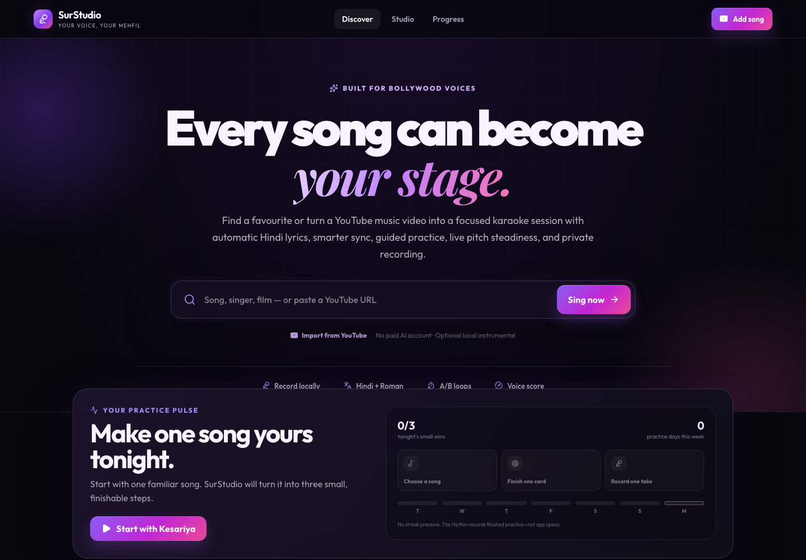
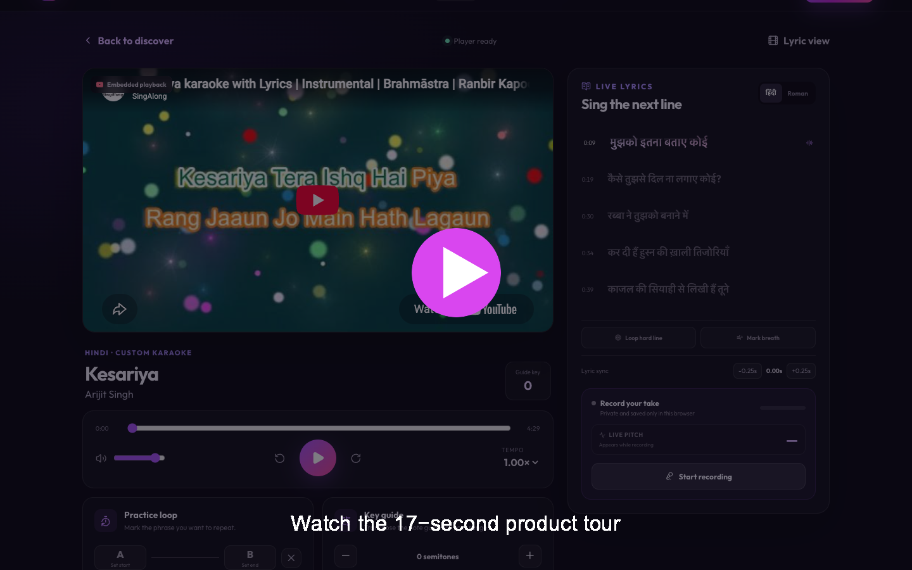
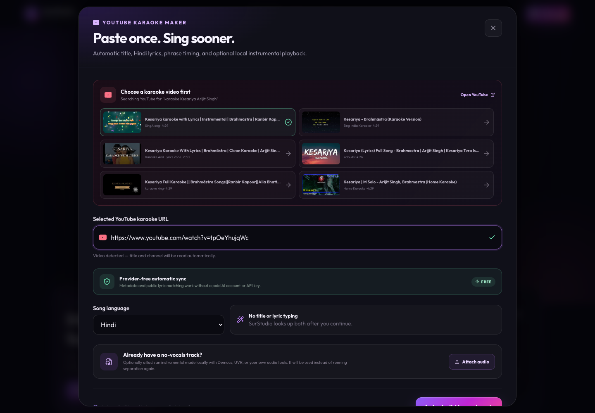
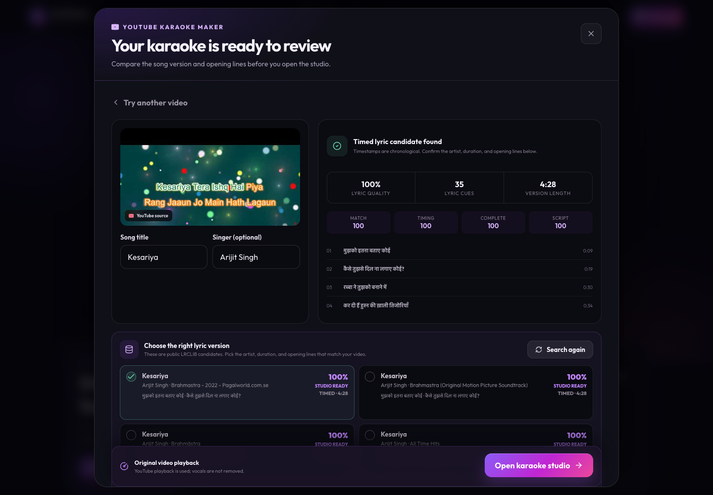
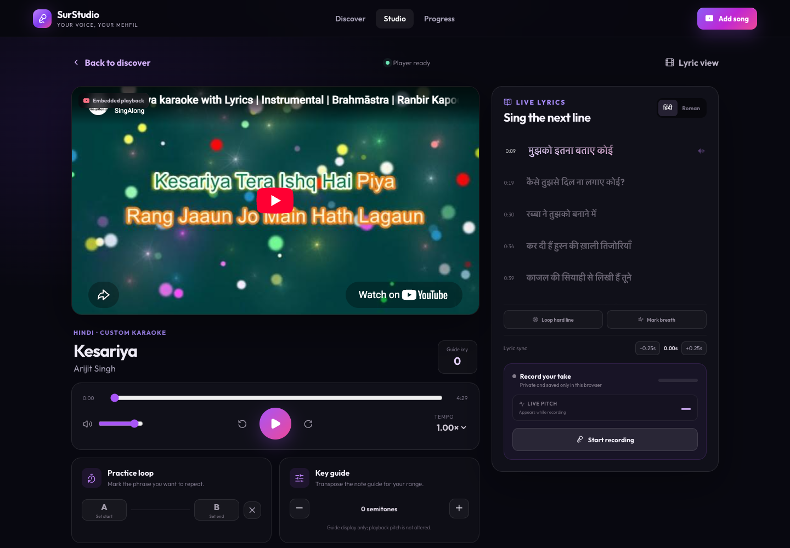

<div align="center">

# SurStudio

### Every song can become your stage.

**A private Hindi and Bollywood karaoke studio for Mac.** Find a song, match the right lyrics, practise the difficult moments, record your take, and share the score with people you love.

[Open SurStudio Web](https://surstudio.datasierra.com) · [Download the family beta](https://github.com/rahulbsw/surstudio-karaoke/releases) · [Watch the 17-second tour](docs/media/surstudio-tour.mp4)

</div>



## From “I love this song” to “one more take”

SurStudio turns the scattered work of karaoke practice into one inviting flow. Search for a Bollywood favourite or paste a YouTube link. SurStudio looks for karaoke versions first, matches Hindi lyrics, checks their timing and opens a focused rehearsal room.

No account is needed to sing. On the hosted web app, an optional Google sign-in lets your score history follow you—recordings still stay on your device. No pressure to perform for strangers. Just a better place to sing.

## See it in motion

[](docs/media/surstudio-tour.mp4)

The tour follows one song from discovery to automatic lyric review and into the live karaoke studio.

## Made for the way Bollywood fans actually sing

- **Karaoke-first discovery** — SurStudio searches for singable versions before ordinary music videos and lets you choose the recording that feels right.
- **Hindi lyrics you can verify** — compare versions, opening lines, script, timing and completeness before the session begins.
- **Devanagari or Roman Hindi** — switch reading styles without leaving the song.
- **Practice the hard line** — use A/B loops, lyric offset, breath marks, tempo control and a transposable guide display.
- **A coach between takes** — follow warm-up, pitch, breath, phrasing and performance cards built for short, achievable practice.
- **A score that teaches** — review pitch, timing, range and control, then receive a focused suggestion for the next take.
- **A progress dashboard that feels human** — return to recent songs, favourites, practice days and personal bests without streak anxiety.
- **Private Mehfil Groups** — invite friends and family, compare one best take per singer each week, and keep recordings out of the group.
- **Share the celebration** — create a branded score card and send it through the Mac share sheet or Messages/iMessage.

## One song. Three clear moments.

| Find the right karaoke version | Confirm the lyrics | Make it your rehearsal room |
| --- | --- | --- |
|  |  |  |
| Choose from real karaoke results instead of accepting the first video. | See exactly what matched before you start singing. | Loop, transpose, record and follow the next lyric without losing focus. |

## Private by design

SurStudio is local-first because singing practice should feel safe.

- Microphone analysis and recordings stay on your device unless you explicitly download or share them.
- Practice history and favourites are stored locally. If you choose Google sign-in on the hosted web app, score metadata is also saved privately to your account.
- Mehfil Groups receive only the score metadata needed for their weekly scoreboard. Invitations are expiring, revocable links.
- Audio takes and microphone recordings are never included in cloud score sync.
- The Mac app serves its interface only on your computer’s loopback address.
- Instrumentals and local AI jobs use files you choose and are not uploaded by SurStudio.
- SurStudio does not store Messages recipients, conversations or other app communication.

Internet access is still used for YouTube search and metadata and for public lyric matching. Always use media and lyrics you own or are authorized to use and follow the relevant service terms.

## Family beta for Apple-silicon Macs

The family beta packages the React experience, local Express service and native Swift audio engine into a lightweight Mac app. It uses WebKit, AVAudioEngine and Accelerate while keeping the door open for Core ML and deeper Apple-platform features later.

1. Open the [Releases page](https://github.com/rahulbsw/surstudio-karaoke/releases).
2. Download `SurStudio-Family-Beta-arm64.dmg`.
3. Drag SurStudio into Applications.

The current family build is ad-hoc signed. On first launch, Control-click or right-click SurStudio and choose **Open**. A Developer ID signed and notarized build is planned before wider distribution.

Because this repository is private, only invited GitHub collaborators can access its releases for now.

## What already works

- A 36-song starter catalog across Bollywood, Hindi classics, ghazal, indie, Punjabi, Tamil, Telugu and duets.
- Automatic YouTube title, channel, thumbnail and duration detection.
- Structured lyric matching with alternative versions and a clear readiness score.
- Exact synchronized timestamps when available and phrase-aware estimated timing when they are not.
- Hindi, Hinglish, Punjabi, Tamil and Telugu language support.
- YouTube playback or a locally attached instrumental.
- Live lyrics, local recording, pitch steadiness, practice loops and post-take coaching.
- A local singer dashboard, saved takes, favourites and shareable score cards.
- Optional Apple-silicon workers for local stem separation, transcription and lyric alignment.
- A Local Karaoke Lab for owned or authorized audio/video files when YouTube embedding is unavailable.
- Optional Google sign-in and private score-history sync on the hosted web experience.
- Invite-only Mehfil Groups with three active groups per owner, twelve singers per group, and a fair weekly best-take scoreboard.

## Where SurStudio goes next

- Developer ID signing, notarization and smoother in-app updates.
- A family-friendly iOS companion with shared visual language and native audio tools.
- Carefully packaged Core ML models for faster on-device transcription and alignment.
- Better duet practice and richer family challenges without public engagement pressure.
- Licensed lyric-provider adapters when commercial access is available.

## Build from source

For contributors, SurStudio requires Node.js 20+ and macOS 14+ for the native shell.

```bash
npm install
npm run dev
```

Useful commands:

```bash
npm test                 # JavaScript tests
npm run build            # Production web build
npm run mac:build        # Self-contained SurStudio.app
npm run mac:package      # DMG, ZIP and SHA-256 checksums
swift test --package-path macos
```

Copy `.env.example` to `.env` and set `YOUTUBE_API_KEY` for the most reliable search. The key stays in the local server environment and `.env` is ignored by Git. Without a key, SurStudio can fall back to metadata/search helpers; it does not use `yt-dlp` to copy YouTube media or bypass playback restrictions.

The hosted web build uses Google sign-in and Neon for account-scoped score metadata, private groups, memberships, and hashed invitation tokens. Configure `AUTH_SECRET`, `AUTH_GOOGLE_ID`, `AUTH_GOOGLE_SECRET`, and `DATABASE_URL`; the accepted Google callback is `/api/auth/callback/google` on the deployed origin. Run `npm run db:setup` once to create the hosted tables, or let the first authenticated request initialize them automatically.

The native audio monitor works without Python. Optional local stem separation and alignment can be prepared with:

```bash
npm run mac:setup-ai
npm run mac:probe-ai
```

See [the macOS architecture notes](macos/README.md) and [design QA report](design-qa.md) for implementation details. Every push and pull request is validated in GitHub Actions; version tags build the Apple-silicon family package and publish its release files.

---

<div align="center">

**SurStudio — your voice, your mehfil.**

</div>
